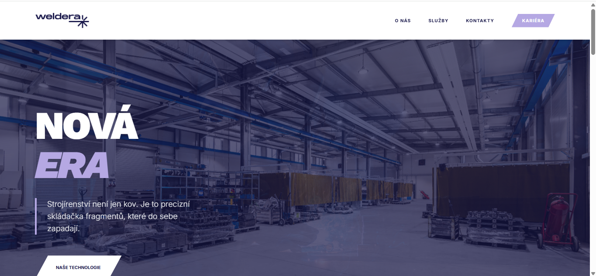

# 🛠️ WELDERA | Industrial Geometry & Precision

[](https://weldera-landing-page.vercel.app/)
[](https://reactjs.org/)
[](https://developer.mozilla.org/en-US/docs/Web/JavaScript)
[](https://tailwindcss.com/)
[](https://developer.mozilla.org/en-US/docs/Web/HTML)
[](https://vitejs.dev/)

---

## 📸 Application Preview



---

## 📝 Concept: Geometry of Excellence

WELDERA is a modern digital presentation for a leader in precision metal machining and industrial technologies. The goal of the project was to create a visual identity that communicates stability, microscopic precision, and technological superiority.

This project was developed as an entry assignment for the company ON BOARD, based strictly on a predefined brief and evaluation criteria. The objective was not only to deliver a visually strong solution, but also to demonstrate architectural thinking, frontend craftsmanship, and production-ready code quality.

The design leverages a sharp visual language built on geometric fragments that reflect processes such as laser cutting and steel welding. The result is a highly responsive, animated landing page with a strong emphasis on clean typography and an industrial color palette.

---

## 🚀 Live Demo

**Production Environment:**
👉 [https://weldera-landing-page.vercel.app/](https://weldera-landing-page.vercel.app/)

---

## 🏗️ Technical Architecture

The project is built as a component-oriented React application, designed for maximum modularity and strict adherence to clean code principles.

**Framework:** React 18
**Styling:** Tailwind CSS 4 (Beta) using @theme variables
**Build Tool:** Vite (Ultra-fast HMR)
**Animation:** Custom Intersection Observer logic & CSS keyframes
**Architecture:** Custom Hooks & Atomic Component Design

A pure frontend solution optimized for ultra-fast loading and excellent Lighthouse performance scores.

---

## 📐 Industrial Design Language

The visual core is defined by a unique system of geometric clipping (clip-path masks):

* **Zigzag Edges:** Aggressive industrial section dividers evoking cutting edges.
* **Weldera Fragments:** Characteristic beveled polygons (parallelograms) used for UI elements and accents.
* **Typography:** Combination of Work Sans for technical headings and Inter for maximum text readability.

---

## ✨ Key Features

* **Smart Navigation:** A dynamic navbar that intelligently reacts to scroll direction to maximize viewport usage.
* **Reveal Animations:** A universal useIntersectionObserver hook ensuring smooth content reveal on scroll.
* **Custom Geometric UI:** A custom CSS polygon library for buttons and decorative elements without heavy SVG assets.
* **Mobile-First UX:** Fully adaptive hamburger menu with a glassmorphism effect and smooth transformations.

---

## 📂 Project Structure

```plaintext
weldera/
├─ src/
│  ├─ components/          # Modular UI blocks
│  │  ├─ Navbar.jsx        # Smart nav & mobile overlay
│  │  ├─ Hero.jsx          # Entry visual gateway
│  │  ├─ Services.jsx      # Professional focus grid
│  │  ├─ ScrollToTop.jsx   # Integrated back-to-top navigation
│  │  └─ ...
│  ├─ hooks/               # Encapsulated logic
│  │  ├─ useScrollDirection.js
│  │  └─ useIntersectionObserver.js
│  ├─ assets/              # Static resources (Logos, Textures)
│  ├─ App.jsx              # Central component orchestration
│  └─ index.css            # Global Tailwind 4 configuration
```

---

## ⚙️ Local Development

### Clone the repository:

```bash
git clone https://github.com/janpivonka/weldera.git
cd weldera
npm install
```

### Run the development server:

```bash
npm run dev
```

---

## 👤 Author

**Jan Pivoňka (Peony)**
Architect of Industrial Code

GitHub: [https://github.com/janpivonka](https://github.com/janpivonka)
